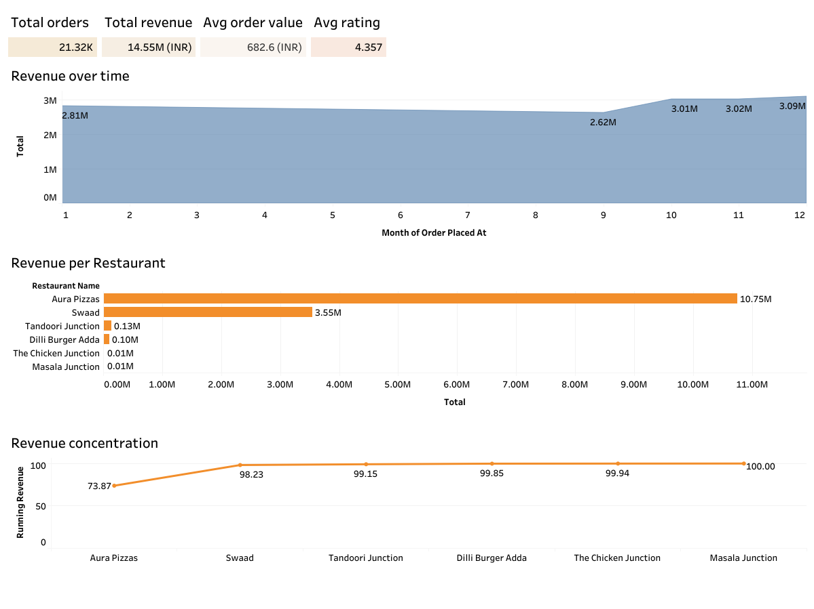
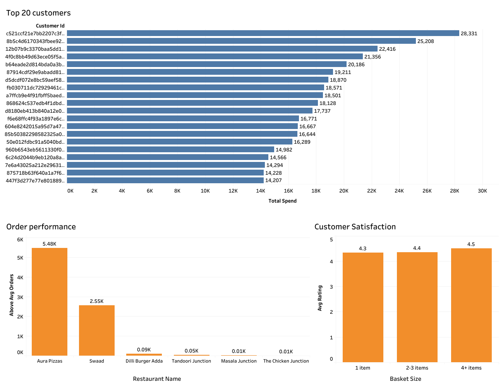

# Food Delivery Business Analytics

### End-to-End SQL & Tableau Project

## Project Overview

This project analyzes operational and customer data from a food delivery business in India. The objective was to identify revenue drivers, customer behavior, restaurant performance, and operational trends using SQL and Tableau.

The project follows an end-to-end analytics workflow, transforming raw data into business insights and recommendations.

**Tools:** PostgreSQL • Tableau • Excel • GitHub

---

## Business Questions

This project answers the following business questions:

- Which restaurants generate the highest revenue?
- How is revenue distributed among restaurants?
- Is revenue concentrated among a small number of restaurants?
- Who are the highest-value customers?
- Does basket size influence customer satisfaction?
- How do restaurants compare in total order volume?
- Does delivery distance influence customer ratings?
- Does weather affect customer satisfaction?

---

## Repository Structure

```text
food_delivery_business_analysis/
│
├── data/
│   ├── clean_orders.csv
│   ├── customer_details.csv
│   ├── customer_summary.csv
│   └── weather_daily.csv
│
├── exports/
│   ├── 1.restaurant_revenue.csv
│   ├── 2.order_performance.csv
│   ├── 3.top_20_customers.csv
│   ├── 4.revenue_share_restaurants.csv
│   └── 5.basket_size_vs_ratings.csv
│
├── images/
│   ├── executive_dashboard_1.png
│   └── executive_dashboard_2.png
│
├── report/
│   └── Food_Delivery_Business_Analysis.pdf
│
├── sql/
│   └── food_delivery_analysis.sql
│
└── tableau/
    └── tableau.twbx
```

---

## SQL Techniques

Throughout this project I applied:

- INNER JOIN
- GROUP BY
- Aggregate Functions (`SUM`, `COUNT`, `AVG`)
- CASE WHEN
- Conditional Aggregation, Conditional Transformation
- Common Table Expressions (CTEs)
- Window Functions
- Revenue Share Calculations

---

## Dashboard Preview

### Executive Dashboard 1



### Executive Dashboard 2



---

## Key Findings

- Revenue is highly concentrated among two restaurants, accounting for over **98%** of total revenue.
- Aura Pizzas generated the highest revenue, followed by Swaad.
- The Top 20 customers contributed significantly more revenue than the average customer.
- Larger basket sizes were associated with slightly higher customer ratings.
- Revenue remained relatively stable throughout the year, with noticeable growth during the final months.
- Customer ratings remained consistently high across different delivery conditions.

---

## Business Recommendations

Based on the analysis, the following recommendations were identified:

- Diversify restaurant partnerships to reduce revenue concentration.
- Strengthen loyalty initiatives for high-value customers.
- Encourage larger basket sizes through bundle promotions and upselling.
- Monitor seasonal demand to improve operational planning.
- Continue tracking operational KPIs through dashboards to support data-driven decision-making.

---

## Report

A complete business report is included in the **report** folder, summarizing the methodology, dashboards, findings, and business recommendations.

---

## Project Workflow

```
Business Questions
        │
        ▼
 SQL Data Exploration
        │
        ▼
 Data Cleaning & Analysis
        │
        ▼
 KPI Creation
        │
        ▼
 Tableau Dashboards
        │
        ▼
 Business Insights
        │
        ▼
 Recommendations
```

---

## Data Source

**Dataset:** Kaggle Food Delivery Dataset

Used for educational and portfolio purposes.

---

## About This Project

This project was developed as part of my Data Analytics learning journey to strengthen my SQL, Tableau, and business analysis skills. It demonstrates an end-to-end workflow, from raw datasets to actionable business insights, while emphasizing analytical thinking, data validation, and clear communication of results.
